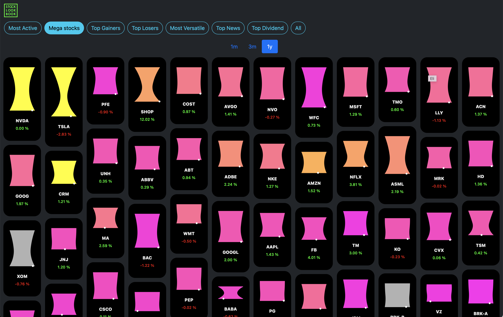

# Stock Lookbook

### Stock visualizations for the visual learners

Sometimes I am surprised at how ignorant I am about the stats of the stocks I have had over the past years. And, I know I am not the only one. For visual learners like me, I made a visualization of the performance, volatility, and valuation of stocks, which I believe are the three most basic things.

The height of the diagram represents performance and the width represents volatility over the past period. Intuitively, the higher the performance, the higher it is, and the more volatile, the thinner it is. Plus, the third attribute, price to earnings ratio, is expressed as a color, and it has a higher P/E as it goes from pink to yellow.

Now, you can grasp the performance, volatility, and price tag of trending stocks at a glance at the following address.

